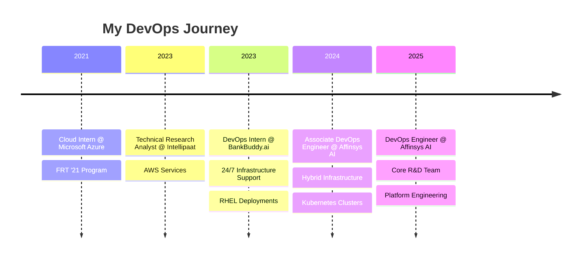

<div align="center">

**`> Linux boxes, container networks, and everything in between`**

<br/>

<!-- Social Badges with Hover Effect -->
<a href="https://www.linkedin.com/in/jayeshsavkare"></a>
<a href="https://jayesh.savkare.com"></a>
<a href="https://jayeshsays.blog/"></a>
<a href="mailto:jayesh.savkare.work@gmail.com"></a>

<br/>


</div>

---

<!-- About Section with Animation -->


## 🧑‍💻 `whoami`

```yaml
name: Jayesh Savkare
role: DevOps Engineer @ Affinsys AI
location: Bengaluru, India 🇮🇳
experience: 1.5+ years

current_focus:
  - Platform Engineering
  - GitOps & Infrastructure as Code
  - Cloud Native Solutions

philosophy: |
  "Build systems that heal themselves,
   so teams can focus on innovation."
```

<br clear="right"/>

---

## 🎯 What I Bring to the Table

<table>
<tr>
<td width="50%" align="center">


### ☁️ Multi-Cloud
AWS • Azure • GCP • OCI

</td>
<td width="50%" align="center">


### 🐳 Container Orchestration
Kubernetes • Docker • Helm

</td>
</tr>
<tr>
<td width="50%" align="center">


### 🔄 CI/CD & GitOps
Jenkins • ArgoCD • GitHub Actions

</td>
<td width="50%" align="center">


### 📊 Observability
Prometheus • Grafana • Loki

</td>
</tr>
</table>

---

## 🏅 Certifications

<div align="center">


</div>

---

## 🛠️ Tech Stack

<div align="center">

### ☁️ Cloud & Infrastructure


### 🐳 Containers & Orchestration


### 🔄 CI/CD & Automation


### 📊 Monitoring & Security


### 🖥️ Systems & Tools


### 💻 Languages


</div>

---

## 💼 Career Timeline



<details>
<summary><b>📋 Click to see detailed experience</b></summary>

<br/>

### 🚀 DevOps Engineer @ Affinsys AI
**Jul 2025 - Present** • Bengaluru

> Core R&D Team • Platform Engineering

| Responsibility | Impact |
|---------------|--------|
| ☸️ K8s cluster management | High-availability SaaS platform |
| 🔧 On-prem + Cloud infra | Hybrid infrastructure |
| 🔔 24×7 on-call support | <5 min incident response |
| 👥 Team mentorship | Onboarded 3+ engineers |

---

### 🔧 Associate DevOps Engineer @ Affinsys AI  
**Jul 2024 - Jun 2025** • Bengaluru

- ✅ Hybrid infrastructure management (on-prem + multi-cloud)
- ✅ Built secure, production-grade Kubernetes clusters
- ✅ Performance tuning: Nginx, MinIO, Cloudflare stack
- ✅ Automated monitoring with custom alerting pipelines

---

### 🎓 DevOps Intern @ BankBuddy.ai
**Dec 2023 - Jun 2024** • Bengaluru

- 📦 RHEL server deployments across multiple environments
- 🐍 Python automation for container resource monitoring
- 🧪 JMeter automation testing integration

</details>

---

## 📊 GitHub Analytics

<div align="center">


<br/>


<br/>

<!-- GitHub Activity Graph -->


</div>

---

## 🎓 Education

<div align="center">

```
🎓 B.Tech in Computer Science Engineering
   Lovely Professional University • 2020 - 2024
   
   🏅 Merit-Based Scholarship Recipient
```

</div>

---

## 📚 Currently Learning

<div align="center">

| 🎯 Focus Area | 📖 Topics |
|:------------:|:----------|
| 🔐 | Advanced Kubernetes Security & Networking |
| 🔄 | GitOps Patterns & Best Practices |
| ⚡ | Serverless & Event-Driven Architectures |
| 🐍 | Python & Go for Platform Tooling |

</div>

---

## 📝 Latest Blog Posts

<!-- BLOG-POST-LIST:START -->
🔗 Check out my thoughts on DevOps, Cloud, and Infrastructure at **[jayeshsays.blog](https://jayeshsays.blog/)**
<!-- BLOG-POST-LIST:END -->

---

<div align="center">

## 🤝 Let's Connect!

<a href="https://www.linkedin.com/in/jayeshsavkare">

</a>
<a href="https://jayesh.savkare.com">

</a>
<a href="https://jayeshsays.blog/">

</a>
<a href="mailto:jayesh.savkare.work@gmail.com">

</a>

<br/><br/>

### 💡 Open to collaborating on DevOps, Cloud, and Platform Engineering projects!

<br/>


</div>


